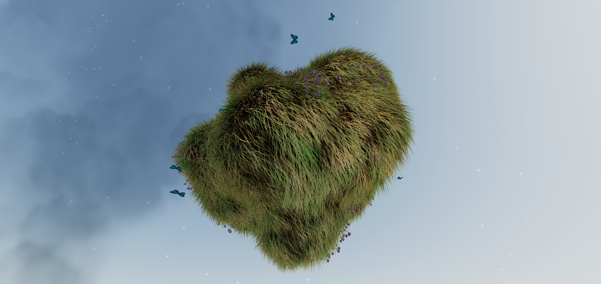

# Grass-Builder
<p align="center">
3D rock environment avatar-inspired using react and three.js
<br>
<br>        
<a href="https://dbis7m.csb.app">
        
    </a>
<br>
<a href="https://dbis7m.csb.app">
        Demo
    </a>
</p>

## Windows Setup

## Installation
Make sure you have installed Node.js and NPM first:<br>
(This is for checking the installed versions)

For Node:
```
node -v
```
For NPM:
```
npm -v
```

If not: download Node.js from [Here](https://nodejs.org/en/)<br>
And then install it on your computer 

### Let's install our project's dependencies once we're done with Node.js
(Open the project in VS Code, Run the terminal and type)<br>
Install dependencies:

```
npm install
```

Compile the code for development and start a local server:

```
npm start
```

## Used Tools

<details>
  <summary>Used Frameworks</summary>
  

1. [React](https://reactjs.org).    

</details>


<details>
  <summary> Libraries</summary>
  

1. [ThreeJS](https://threejs.org)   

</details>


## Follow me on

[Instagram](https://www.instagram.com/houssem_lachtar/), [Linkedin ](https://www.linkedin.com/in/houssem-lachtar/), [Codepen](https://codepen.io/houssem-lachtar), [GitHub](https://github.com/houssemlachtar)
